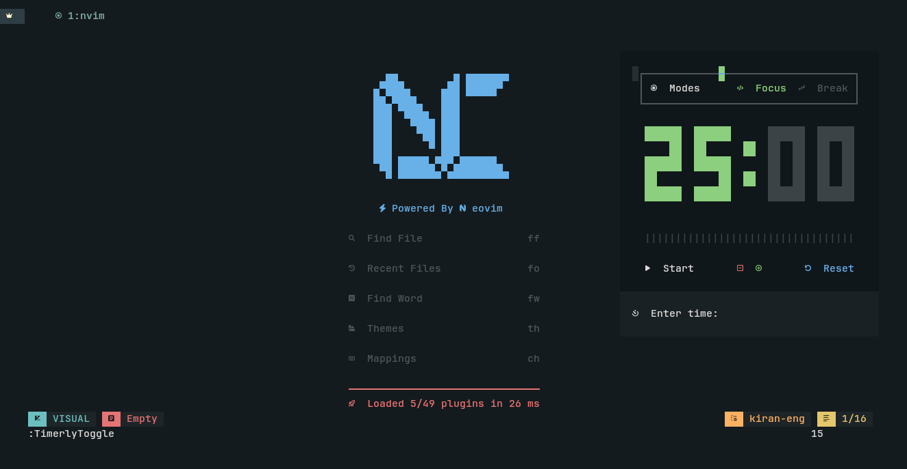

# 🌟 Neovim for Students & Developers — Supercharge Your Productivity!

> ⚡ A clean, powerful, and extensible Neovim setup — ideal for **Sistem Informasi students**, developers, and lifelong learners.


---

## 🎯 Siapa yang Cocok?

Konfigurasi ini dibuat khusus untuk:

- Mahasiswa **Sistem Informasi**, **Informatika**, atau **Ilmu Komputer**
- Pengembang backend, AI enthusiast, dan pembelajar yang suka terminal
- Siapapun yang ingin produktif dengan editor ringan namun sangat powerful

---

## 🔥 Fitur Unggulan

### 🧠 Intelligent Code Completion  
Powered by **LSP** seperti `jdtls`, `sql`,  dll. Menampilkan suggestion kode secara real-time seperti IDE modern.

### 🎨 UI Elegan dan Minimalis  
Menggunakan plugin seperti `lualine`,  dan `telescope` dengan tampilan yang clean dan estetis, cocok untuk coding panjang tanpa lelah.

### 🚀 Startup Cepat dan Ringan  
Tanpa beban seperti IDE berat. Cocok untuk laptop mahasiswa dengan spesifikasi standar.

### 🔌 Plugin Manager Modern  
Menggunakan `lazy.nvim`, mudah untuk menambah, menghapus, dan mengatur plugin.

### 💾 Integrasi Database  
Dengan `vim-dadbod`, `DBUI`, dan `completion`, kamu bisa menjalankan query langsung dari Neovim — cocok untuk praktikum Basis Data!


### 🧩 Modular & Mudah Dikustomisasi  
Struktur konfigurasi modular memudahkan kamu untuk belajar, eksplorasi, dan menyesuaikan dengan kebutuhan pribadi.

---

## ✨ Mengapa Mahasiswa Harus Coba?

- **Belajar tools profesional sejak dini**
- **Pahami cara kerja editor dari dalam (bukan hanya klik-klik IDE)**
- **Tingkatkan kecepatan coding dan pemahaman struktur proyek**
- **Latihan terminal dan CLI untuk dunia kerja**

---

## 📷 Screenshots

>

---
## 📥 Prasyarat

Sebelum menggunakan konfigurasi ini, pastikan kamu sudah menginstal:

---

### ✅ **Neovim Versi Terbaru**

Disarankan menggunakan **Neovim v0.9+** atau **v0.10+** untuk kompatibilitas penuh dengan semua fitur plugin modern.

🔗 Unduh Neovim dari situs resmi:  
➡️ [https://neovim.io](https://neovim.io)

Atau langsung dari GitHub Releases:  
➡️ [https://github.com/neovim/neovim/releases](https://github.com/neovim/neovim/releases)

> ⚠️ Versi lawas mungkin tidak kompatibel dengan fitur seperti LSP, Treesitter, atau lazy.nvim.

---

### 🧩 **NvChad (Opsional)**

Konfigurasi ini juga dari basis **NvChad**, framework modular Neovim yang ringan dan siap pakai. tapi saya menambahkan beberapa plugin untuk keperluan !!

🔧 Cara instalasi:

## 🛠️ Instalasi

```bash
git clone https://github.com/UT-x-OSS/nvim.git ~/.config/nvim --depth 1 && nvim

